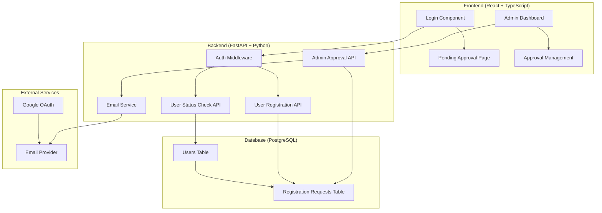

# Design Document: Admin Approval System

## Overview

The admin approval system introduces a gated registration process for the wellness application. Instead of immediate access after Google OAuth, new users enter a pending state requiring admin approval. The system consists of database schema changes, API endpoints for approval management, email notifications, and frontend components for both user and admin interfaces.

The design leverages the existing FastAPI backend, React frontend, PostgreSQL database, and Google OAuth authentication while adding minimal complexity to achieve the approval workflow.

## Architecture

### High-Level Architecture



### Component Interaction Flow

1. **New User Registration**: User authenticates via Google OAuth → System creates pending registration request → Admin receives email notification
2. **Admin Approval**: Admin views pending requests in dashboard → Approves/declines request → User receives email notification → User status updated
3. **User Access**: User attempts login → System checks approval status → Grants access or shows pending page

## Components and Interfaces

### Database Schema

#### Registration Requests Table
```sql
CREATE TABLE registration_requests (
    id SERIAL PRIMARY KEY,
    email VARCHAR(255) UNIQUE NOT NULL,
    name VARCHAR(255) NOT NULL,
    google_id VARCHAR(255) NOT NULL,
    status VARCHAR(20) DEFAULT 'pending' CHECK (status IN ('pending', 'approved', 'declined')),
    created_at TIMESTAMP DEFAULT CURRENT_TIMESTAMP,
    updated_at TIMESTAMP DEFAULT CURRENT_TIMESTAMP
);
```

#### Users Table Enhancement
```sql
ALTER TABLE users ADD COLUMN approval_status VARCHAR(20) DEFAULT 'pending' 
CHECK (approval_status IN ('pending', 'approved', 'declined'));
```

### Backend API Endpoints

#### Authentication & Registration
```python
# POST /auth/register
class RegistrationRequest(BaseModel):
    email: str
    name: str
    google_id: str

class RegistrationResponse(BaseModel):
    status: str
    message: str
    user_id: Optional[int]
```

#### Admin Management
```python
# GET /admin/pending-requests
class PendingRequestResponse(BaseModel):
    requests: List[RegistrationRequestModel]
    count: int

# POST /admin/approve-user/{user_id}
# POST /admin/decline-user/{user_id}
class ApprovalResponse(BaseModel):
    success: bool
    message: str
```

#### User Status
```python
# GET /auth/status
class UserStatusResponse(BaseModel):
    status: str  # 'pending', 'approved', 'declined'
    message: str
```

### Frontend Components

#### Authentication Flow Components
- **PendingApprovalPage**: Displays waiting message for pending users
- **AuthGuard**: Route protection based on approval status
- **LoginHandler**: Modified to handle approval status after OAuth

#### Admin Dashboard Components
- **PendingRequestsList**: Displays list of pending registration requests
- **ApprovalActions**: Approve/decline buttons with confirmation
- **RequestCard**: Individual request display with user details

### Email Service Integration

#### Email Templates
- **Admin Notification**: New user registration alert
- **User Approval**: Welcome message with access instructions
- **User Decline**: Polite decline message with next steps

#### Email Service Interface
```python
class EmailService:
    async def send_admin_notification(self, user_data: dict) -> bool
    async def send_user_approval(self, user_email: str, user_name: str) -> bool
    async def send_user_decline(self, user_email: str, user_name: str) -> bool
```

## Data Models

### Registration Request Model
```python
class RegistrationRequest(SQLAlchemyModel):
    id: int
    email: str
    name: str
    google_id: str
    status: str  # 'pending', 'approved', 'declined'
    created_at: datetime
    updated_at: datetime
    
    def approve(self) -> None
    def decline(self) -> None
    def is_pending(self) -> bool
```

### User Model Enhancement
```python
class User(SQLAlchemyModel):
    # existing fields...
    approval_status: str
    
    def is_approved(self) -> bool
    def set_approval_status(self, status: str) -> None
```

### Email Template Models
```python
class EmailTemplate:
    subject: str
    html_content: str
    
    def render(self, **kwargs) -> str

class AdminNotificationTemplate(EmailTemplate):
    # Template for notifying admin of new registration
    
class UserApprovalTemplate(EmailTemplate):
    # Template for user approval notification
    
class UserDeclineTemplate(EmailTemplate):
    # Template for user decline notification
```

## Correctness Properties

*A property is a characteristic or behavior that should hold true across all valid executions of a system-essentially, a formal statement about what the system should do. Properties serve as the bridge between human-readable specifications and machine-verifiable correctness guarantees.*

### Property 1: Registration Request Creation
*For any* new user completing Google OAuth authentication, the system should create a Registration_Request with pending status and store all required user information (email, name, google_id, timestamp).
**Validates: Requirements 1.1, 1.4, 7.1**

### Property 2: Pending User Access Control
*For any* user with pending approval status, attempting to access protected routes should redirect them to the pending approval page instead of granting access.
**Validates: Requirements 1.2, 1.3, 5.2**

### Property 3: Admin Notification Trigger
*For any* new Registration_Request created, the system should send an email notification to the admin and display the request in the admin dashboard.
**Validates: Requirements 2.1, 2.3**

### Property 4: Email Content Completeness
*For any* email sent by the system (admin notifications, user approvals, user declines), the email should contain all required information in HTML format using appropriate templates.
**Validates: Requirements 2.2, 4.3, 4.4, 6.1, 6.2, 6.3**

### Property 5: Dashboard Display Accuracy
*For any* admin dashboard load, the system should display accurate counts of pending requests and show complete user details (name, email, registration date) for each pending request with approve/decline buttons.
**Validates: Requirements 2.4, 3.1, 8.1, 8.2, 8.3**

### Property 6: Status Update Consistency
*For any* admin approval or decline action, the system should immediately update the user status in the database and refresh the dashboard display.
**Validates: Requirements 3.2, 3.3, 3.4, 7.2**

### Property 7: User Notification on Status Change
*For any* status change (approval or decline), the system should send the appropriate notification email to the affected user.
**Validates: Requirements 4.1, 4.2**

### Property 8: Authentication Status Validation
*For any* authentication attempt, the system should validate the current user status from the database and grant appropriate access (normal access for approved users, pending page for pending users, new registration option for declined users).
**Validates: Requirements 5.1, 5.2, 5.3, 5.4, 5.5**

### Property 9: Duplicate Registration Prevention
*For any* email address with an existing pending Registration_Request, attempting to create another Registration_Request should be prevented.
**Validates: Requirements 7.3**

## Error Handling

### Authentication Errors
- **OAuth Failure**: Redirect to login with error message
- **Invalid User Status**: Log error and default to pending status
- **Database Connection Issues**: Show maintenance message to user

### Email Service Errors
- **Email Delivery Failure**: Log error but continue with approval process
- **Template Rendering Errors**: Use fallback plain text templates
- **Invalid Email Addresses**: Log warning and skip email sending

### Admin Dashboard Errors
- **API Request Failures**: Show error toast and retry option
- **Concurrent Approval Conflicts**: Refresh data and show current status
- **Permission Errors**: Redirect to login if admin session expired

### Data Validation Errors
- **Missing Required Fields**: Return validation error with specific field information
- **Invalid Status Transitions**: Prevent invalid status changes and log attempts
- **Database Constraint Violations**: Handle gracefully with user-friendly messages

## Testing Strategy

### Dual Testing Approach
The system will use both unit testing and property-based testing for comprehensive coverage:

**Unit Tests** will focus on:
- Specific examples of the approval workflow
- Edge cases like empty email lists or network failures
- Integration points between frontend and backend components
- Error conditions and exception handling

**Property-Based Tests** will focus on:
- Universal properties that hold across all user inputs
- Comprehensive input coverage through randomization
- Correctness properties defined in this design document

### Property-Based Testing Configuration
- **Testing Library**: Use Hypothesis for Python backend tests, fast-check for TypeScript frontend tests
- **Test Iterations**: Minimum 100 iterations per property test
- **Test Tagging**: Each property test must reference its design document property using the format: **Feature: admin-approval-system, Property {number}: {property_text}**

### Testing Coverage Requirements
- Each correctness property must be implemented by a single property-based test
- Unit tests should complement property tests by covering specific examples and edge cases
- Integration tests should verify the complete user journey from registration to approval
- Email functionality should be tested with mock email services to avoid external dependencies

The combination of unit and property-based testing ensures both concrete bug detection and general correctness validation across the entire approval system.