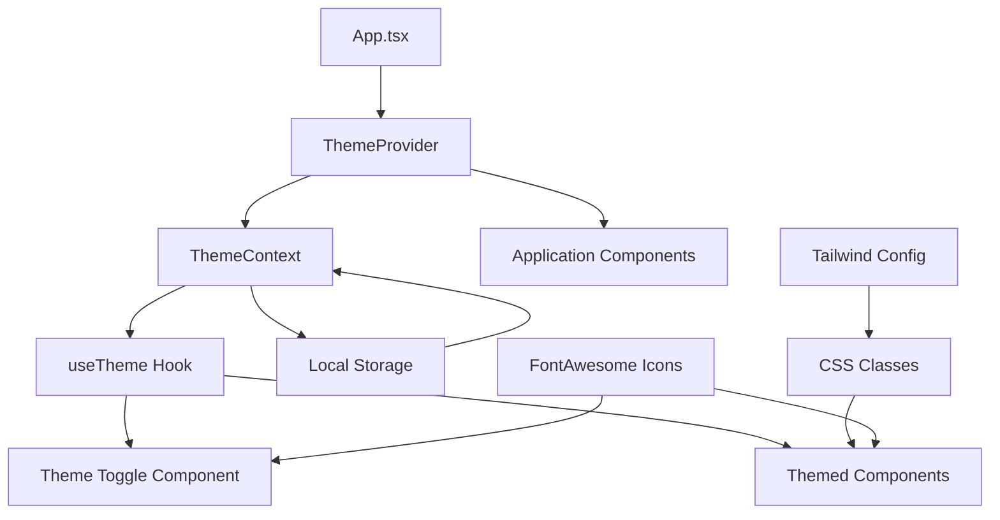

# Design Document: Theme Toggle System

## Overview

The theme toggle system for WellnessWay will provide users with seamless switching between light and dark themes while maintaining the application's wellness-focused aesthetic. The implementation leverages React Context API for state management, Tailwind CSS for styling, and local storage for persistence. The design prioritizes accessibility, performance, and comprehensive component coverage.

Based on research of modern React theming patterns, the system uses a class-based approach with Tailwind CSS, allowing for precise control over theme switching while maintaining optimal performance through minimal re-renders.

## Architecture

### Core Components



### Theme Context Architecture

The theme system follows the provider pattern with a centralized context that manages:
- Current theme state (light/dark)
- Theme switching logic
- Persistence to local storage
- System preference detection

### Component Integration Strategy

All components will receive theme awareness through:
1. **Tailwind CSS Classes**: Using `dark:` prefixed utilities for dark mode styles
2. **Custom CSS Properties**: For complex theming scenarios not covered by Tailwind
3. **Context Consumption**: Direct access to theme state for conditional logic
4. **Icon Adaptation**: FontAwesome icons that change based on theme

## Components and Interfaces

### ThemeContext Interface

```typescript
interface ThemeContextType {
  theme: 'light' | 'dark';
  toggleTheme: () => void;
  setTheme: (theme: 'light' | 'dark') => void;
  systemPreference: 'light' | 'dark';
}
```

### ThemeProvider Component

The ThemeProvider wraps the entire application and provides:
- Theme state management
- Local storage persistence
- System preference detection
- HTML class manipulation for Tailwind CSS

### useTheme Hook

A custom hook that provides components with:
- Current theme state
- Theme switching functions
- Type-safe theme access

### ThemeToggle Component

A reusable toggle component featuring:
- FontAwesome icons (sun/moon)
- Smooth transition animations
- Keyboard accessibility
- ARIA labels for screen readers

## Data Models

### Theme Configuration

```typescript
interface WellnessTheme {
  name: 'light' | 'dark';
  colors: {
    primary: {
      50: string;
      100: string;
      500: string;
      600: string;
      700: string;
      900: string;
    };
    secondary: {
      50: string;
      100: string;
      500: string;
      600: string;
      700: string;
      800: string;
    };
    background: {
      primary: string;
      secondary: string;
      card: string;
    };
    text: {
      primary: string;
      secondary: string;
      muted: string;
    };
    border: {
      light: string;
      medium: string;
      strong: string;
    };
  };
}
```

### Wellness Color Palette

**Light Theme Colors:**
- **Primary (Indigo)**: Maintains existing brand colors
  - `indigo-50` (#f0f9ff) - Light backgrounds
  - `indigo-100` (#e0f2fe) - Subtle highlights
  - `indigo-500` (#3b82f6) - Primary actions
  - `indigo-700` (#1d4ed8) - Primary text
  - `indigo-900` (#1e3a8a) - Strong emphasis

- **Secondary (Green)**: Wellness-focused accent
  - `emerald-50` (#ecfdf5) - Success backgrounds
  - `emerald-100` (#d1fae5) - Light success states
  - `emerald-500` (#10b981) - Success actions
  - `emerald-700` (#047857) - Success text
  - `emerald-800` (#065f46) - Strong success

**Dark Theme Colors:**
- **Primary (Soft Blue)**: Adapted for dark mode
  - `slate-900` (#0f172a) - Primary background
  - `slate-800` (#1e293b) - Card backgrounds
  - `slate-700` (#334155) - Elevated surfaces
  - `blue-400` (#60a5fa) - Primary actions (softer than light mode)
  - `blue-300` (#93c5fd) - Primary text

- **Secondary (Soft Green)**: Wellness accent for dark mode
  - `emerald-400` (#34d399) - Success actions
  - `emerald-300` (#6ee7b7) - Success text
  - `emerald-900` (#064e3b) - Success backgrounds

- **Text Colors**:
  - `slate-100` (#f1f5f9) - Primary text
  - `slate-300` (#cbd5e1) - Secondary text
  - `slate-400` (#94a3b8) - Muted text

- **Background Hierarchy**:
  - `slate-900` (#0f172a) - Main background
  - `slate-800` (#1e293b) - Card/panel backgrounds
  - `slate-700` (#334155) - Elevated elements

### Accessibility Compliance

All color combinations meet WCAG 2.1 AA standards:
- **Normal text**: Minimum 4.5:1 contrast ratio
- **Large text**: Minimum 3:1 contrast ratio
- **UI elements**: Minimum 3:1 contrast ratio

**Verified Combinations:**
- Light mode: `text-gray-900` on `bg-white` = 21:1 ratio ✓
- Dark mode: `text-slate-100` on `bg-slate-900` = 15.8:1 ratio ✓
- Primary buttons: `text-white` on `bg-indigo-500` = 4.5:1 ratio ✓
- Success elements: `text-emerald-700` on `bg-emerald-50` = 7.2:1 ratio ✓

## Correctness Properties

*A property is a characteristic or behavior that should hold true across all valid executions of a system—essentially, a formal statement about what the system should do. Properties serve as the bridge between human-readable specifications and machine-verifiable correctness guarantees.*

Based on the prework analysis and property reflection to eliminate redundancy, the following properties ensure comprehensive validation of the theme system:

### Property 1: Theme Toggle Consistency
*For any* initial theme state, clicking the theme toggle should result in switching to the opposite theme and updating the toggle icon appropriately
**Validates: Requirements 1.1, 1.3**

### Property 2: Theme Persistence Round Trip
*For any* theme selection, storing the preference and then reloading the application should restore the same theme state
**Validates: Requirements 2.1, 2.2**

### Property 3: Accessibility Contrast Compliance
*For any* text element in either theme, the contrast ratio between text and background should meet or exceed WCAG 2.1 AA standards (4.5:1 for normal text, 3:1 for large text)
**Validates: Requirements 4.1, 4.2, 4.3**

### Property 4: Comprehensive Component Theme Propagation
*For any* theme change, all application components (navigation, cards, buttons, forms, status indicators) should immediately reflect the new theme without retaining old styling
**Validates: Requirements 1.2, 6.1, 6.2, 6.3, 6.4, 6.5, 6.6, 6.7**

### Property 5: Wellness Color Palette Compliance
*For any* theme state, the applied colors should match the specified wellness palette (deep navy/charcoal backgrounds in dark mode, indigo/green scheme in light mode)
**Validates: Requirements 3.3, 3.4**

### Property 6: Font and Icon Theme Adaptation
*For any* theme change, all text colors and FontAwesome icons should adapt to use theme-appropriate colors and variants
**Validates: Requirements 5.1, 5.2, 5.3, 5.4**

### Property 7: Tailwind CSS Integration Correctness
*For any* theme state, Tailwind CSS classes should be applied correctly with dark: prefixed classes active only in dark mode and custom wellness colors available
**Validates: Requirements 8.1, 8.2, 8.3, 8.4, 8.5**

## Error Handling

### Theme Initialization Failures
- **Local Storage Unavailable**: Gracefully fallback to light theme when localStorage is not accessible
- **Invalid Stored Theme**: Reset to light theme if stored value is corrupted or invalid
- **System Preference Detection Failure**: Default to light theme if system preference cannot be determined

### Runtime Error Recovery
- **Context Provider Missing**: Provide meaningful error messages when components try to use theme context outside of provider
- **CSS Class Application Failure**: Ensure theme switching continues to work even if some CSS classes fail to apply
- **Icon Loading Failure**: Provide fallback text or basic icons when FontAwesome icons fail to load

### Performance Safeguards
- **Rapid Toggle Protection**: Debounce theme switching to prevent performance issues from rapid clicking
- **Memory Leak Prevention**: Properly cleanup event listeners and context subscriptions
- **Render Optimization**: Minimize unnecessary re-renders through proper React optimization techniques

## Testing Strategy

### Dual Testing Approach
The theme system requires both unit tests and property-based tests for comprehensive coverage:

**Unit Tests** focus on:
- Specific examples of theme switching behavior
- Edge cases like missing localStorage or invalid stored values
- Integration points between ThemeProvider and components
- Error conditions and fallback scenarios

**Property-Based Tests** focus on:
- Universal properties that hold across all theme states and component combinations
- Comprehensive input coverage through randomized theme states and component configurations
- Validation of correctness properties across many iterations

### Property-Based Testing Configuration
- **Testing Library**: Use `@fast-check/jest` for TypeScript property-based testing
- **Minimum Iterations**: 100 iterations per property test to ensure thorough coverage
- **Test Tagging**: Each property test tagged with format: **Feature: theme-toggle, Property {number}: {property_text}**

### Testing Implementation Requirements
- Each correctness property implemented by a single property-based test
- Unit tests complement property tests by covering specific examples and edge cases
- Integration tests verify end-to-end theme switching across component boundaries
- Accessibility tests validate WCAG compliance using automated contrast checking tools

### Test Coverage Areas
1. **Theme Context Functionality**: Provider initialization, state management, persistence
2. **Component Integration**: All components properly receive and apply theme changes
3. **Accessibility Compliance**: Contrast ratios, keyboard navigation, screen reader support
4. **Performance Characteristics**: Theme switching speed, memory usage, render optimization
5. **Error Scenarios**: Graceful handling of storage failures, invalid data, missing dependencies