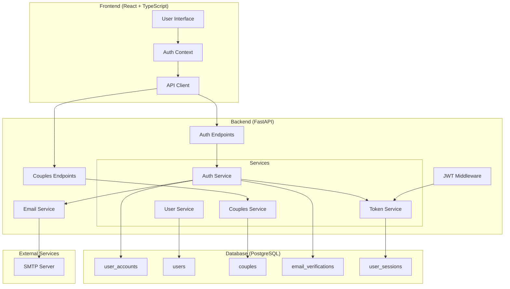
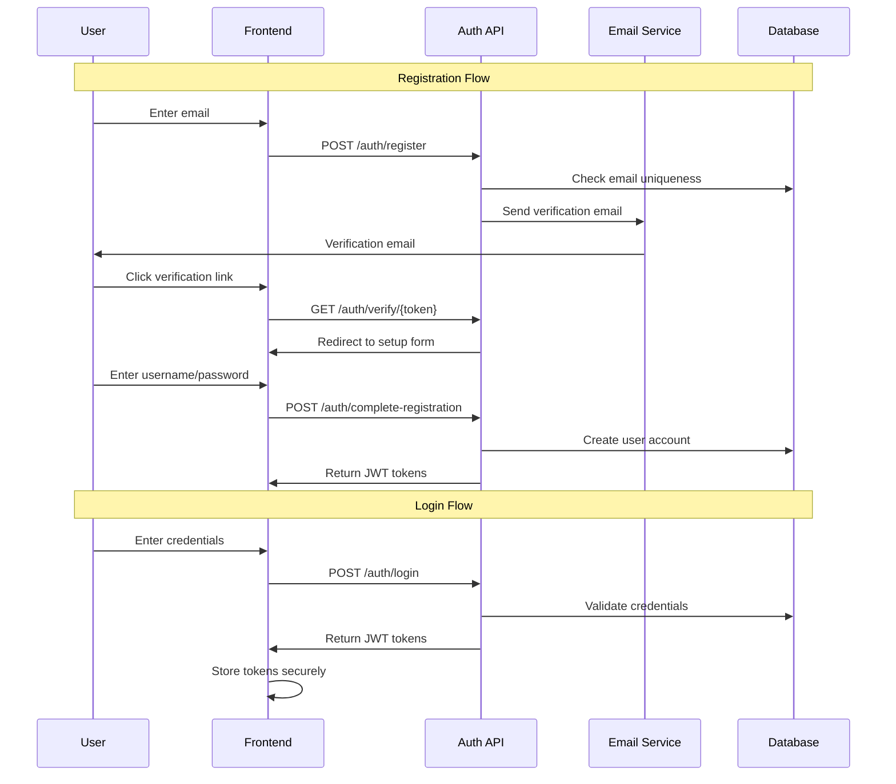

# Design Document: User Authentication and Couples Mode

## Overview

This design implements a comprehensive user authentication system with couples mode functionality for the WellnessWay Diet Planner application. The system provides secure user registration with email verification, JWT-based authentication, and shared diet planning capabilities for couples while maintaining individual user profiles and data integrity.

The design integrates with the existing FastAPI backend and PostgreSQL database, extending the current User, HealthContextDocument, and DietPlan models with authentication capabilities and couple relationships.

## Architecture

### High-Level Architecture



### Authentication Flow



## Components and Interfaces

### Database Models

#### UserAccount Model (New)
```python
class UserAccount(Base):
    __tablename__ = "user_accounts"
    
    id: UUID (Primary Key)
    email: str (Unique, Not Null)
    username: str (Unique, Not Null)
    password_hash: str (Not Null)
    is_email_verified: bool (Default: False)
    is_active: bool (Default: True)
    created_at: datetime
    updated_at: datetime
    last_login: datetime (Nullable)
    
    # Relationship to existing User model
    user_profile_id: UUID (Foreign Key to users.id, Nullable)
```

#### EmailVerification Model (New)
```python
class EmailVerification(Base):
    __tablename__ = "email_verifications"
    
    id: UUID (Primary Key)
    email: str (Not Null)
    token: str (Unique, Not Null)
    expires_at: datetime (Not Null)
    is_used: bool (Default: False)
    created_at: datetime
```

#### UserSession Model (New)
```python
class UserSession(Base):
    __tablename__ = "user_sessions"
    
    id: UUID (Primary Key)
    user_account_id: UUID (Foreign Key)
    refresh_token_hash: str (Not Null)
    expires_at: datetime (Not Null)
    is_active: bool (Default: True)
    created_at: datetime
    last_used: datetime
```

#### Couple Model (New)
```python
class Couple(Base):
    __tablename__ = "couples"
    
    id: UUID (Primary Key)
    user1_id: UUID (Foreign Key to user_accounts.id)
    user2_id: UUID (Foreign Key to user_accounts.id)
    pairing_code: str (Unique, Nullable - null after pairing)
    paired_at: datetime (Not Null)
    is_active: bool (Default: True)
    created_at: datetime
```

### Service Layer

#### AuthenticationService
```python
class AuthenticationService:
    async def register_email(email: str) -> EmailVerificationResponse
    async def verify_email(token: str) -> EmailVerificationResult
    async def complete_registration(token: str, username: str, password: str) -> AuthTokens
    async def login(email: str, password: str) -> AuthTokens
    async def logout(user_id: UUID, refresh_token: str) -> bool
    async def refresh_tokens(refresh_token: str) -> AuthTokens
    async def change_password(user_id: UUID, current_password: str, new_password: str) -> bool
```

#### TokenService
```python
class TokenService:
    def create_access_token(user_id: UUID, expires_delta: timedelta) -> str
    def create_refresh_token(user_id: UUID) -> str
    def verify_token(token: str) -> TokenPayload
    def decode_token(token: str) -> dict
    async def revoke_refresh_token(token: str) -> bool
    async def cleanup_expired_tokens() -> int
```

#### CouplesService
```python
class CouplesService:
    async def generate_pairing_code(user_id: UUID) -> str
    async def pair_with_code(user_id: UUID, pairing_code: str) -> CoupleResponse
    async def get_partner(user_id: UUID) -> Optional[UserAccount]
    async def unpair_couple(user_id: UUID) -> bool
    async def get_shared_diet_plans(user_id: UUID) -> List[DietPlan]
    async def create_shared_diet_plan(user_id: UUID, plan_data: dict) -> DietPlan
```

#### EmailService
```python
class EmailService:
    async def send_verification_email(email: str, token: str) -> bool
    async def send_password_reset_email(email: str, token: str) -> bool
    def generate_verification_token() -> str
    def create_verification_link(token: str) -> str
```

### API Endpoints

#### Authentication Endpoints
```python
# Registration and verification
POST /api/v1/auth/register
POST /api/v1/auth/verify/{token}
POST /api/v1/auth/complete-registration

# Login and logout
POST /api/v1/auth/login
POST /api/v1/auth/logout
POST /api/v1/auth/refresh

# Password management
POST /api/v1/auth/change-password
POST /api/v1/auth/forgot-password
POST /api/v1/auth/reset-password

# User info
GET /api/v1/auth/me
```

#### Couples Endpoints
```python
# Pairing management
POST /api/v1/couples/generate-code
POST /api/v1/couples/pair
DELETE /api/v1/couples/unpair
GET /api/v1/couples/partner

# Shared functionality
GET /api/v1/couples/shared-plans
POST /api/v1/couples/shared-plans
```

## Data Models

### JWT Token Structure
```json
{
  "sub": "user_account_id",
  "email": "user@example.com",
  "username": "username",
  "exp": 1234567890,
  "iat": 1234567890,
  "type": "access|refresh"
}
```

### Registration Request/Response
```json
// Registration Request
{
  "email": "user@example.com"
}

// Registration Response
{
  "message": "Verification email sent",
  "email": "user@example.com"
}

// Complete Registration Request
{
  "token": "verification_token",
  "username": "username",
  "password": "secure_password"
}
```

### Authentication Response
```json
{
  "access_token": "jwt_access_token",
  "refresh_token": "jwt_refresh_token",
  "token_type": "bearer",
  "expires_in": 1800,
  "user": {
    "id": "user_account_id",
    "email": "user@example.com",
    "username": "username",
    "is_email_verified": true
  }
}
```

### Couples Data Models
```json
// Pairing Code Response
{
  "pairing_code": "ABC123",
  "expires_at": "2024-01-01T12:00:00Z"
}

// Couple Response
{
  "id": "couple_id",
  "partner": {
    "id": "partner_id",
    "username": "partner_username",
    "email": "partner@example.com"
  },
  "paired_at": "2024-01-01T12:00:00Z"
}
```

## Correctness Properties

*A property is a characteristic or behavior that should hold true across all valid executions of a system-essentially, a formal statement about what the system should do. Properties serve as the bridge between human-readable specifications and machine-verifiable correctness guarantees.*

Let me analyze the acceptance criteria to determine which ones are testable as properties:

### Property 1: Email Validation and Uniqueness
*For any* email address provided during registration, the system should validate the email format according to RFC standards and reject duplicate emails with appropriate error messages.
**Validates: Requirements 1.1, 1.6**

### Property 2: Email Verification Round Trip
*For any* valid unique email, sending a verification email and using the verification token should successfully complete the email verification process.
**Validates: Requirements 1.2, 3.2, 3.3**

### Property 3: Registration Flow Completion
*For any* valid verification token, username, and password combination, the registration process should create a user account with properly hashed password.
**Validates: Requirements 1.3, 1.5**

### Property 4: Password Security Requirements
*For any* password, the system should enforce minimum 8 characters with uppercase, lowercase, numbers, and special characters, and store all passwords using bcrypt hashing with salt, never in plain text.
**Validates: Requirements 8.1, 8.2, 8.3, 8.4, 8.6**

### Property 5: Authentication Token Generation
*For any* valid user credentials, successful authentication should generate both access and refresh JWT tokens using HS256 algorithm with secure secret keys.
**Validates: Requirements 2.1, 2.7**

### Property 6: Authentication Error Handling
*For any* invalid credentials, missing authentication, or insufficient authorization, the system should return appropriate HTTP status codes (401 for unauthenticated, 403 for unauthorized) with clear error messages.
**Validates: Requirements 2.2, 7.5, 7.6, 7.7**

### Property 7: Token Lifecycle Management
*For any* JWT token, the system should properly handle expiration by allowing refresh token usage for expired access tokens and requiring re-authentication for expired refresh tokens.
**Validates: Requirements 2.4, 2.5**

### Property 8: Session Security Management
*For any* user session, login should create secure sessions with proper expiration, logout should invalidate tokens, and password changes should invalidate all existing sessions.
**Validates: Requirements 2.3, 6.1, 6.3**

### Property 9: Email Verification Token Security
*For any* verification token, it should be cryptographically secure, expire after 24 hours, and only one active token should exist per email address.
**Validates: Requirements 3.1, 3.4, 3.6**

### Property 10: User Data Access Authorization
*For any* authenticated user, they should have access to their own health context documents and diet plan history, but not to other users' data.
**Validates: Requirements 4.2, 4.3, 7.2**

### Property 11: Profile Data Integration
*For any* new user account, existing User profile data should be properly linked and referential integrity should be maintained across all related records.
**Validates: Requirements 4.1, 4.4, 4.5**

### Property 12: Couples Pairing Management
*For any* user initiating couple pairing, a unique pairing code should be generated, and valid codes should create couple relationships with mutual access permissions.
**Validates: Requirements 5.1, 5.2**

### Property 13: Couples Data Access
*For any* paired couple, both users should have access to each other's diet plans and be able to create shared diet plans that consider both users' health contexts.
**Validates: Requirements 5.3, 5.4, 5.5, 7.3**

### Property 14: Couples Relationship Constraints
*For any* user, they should only be able to pair with one other user at a time, and either user should be able to unpair the relationship.
**Validates: Requirements 5.6, 5.7**

### Property 15: Security Monitoring and Rate Limiting
*For any* authentication attempts, the system should implement rate limiting to prevent brute force attacks and log all authentication events for security monitoring.
**Validates: Requirements 6.4, 6.5**

### Property 16: Protected Endpoint Security
*For any* protected API endpoint, JWT tokens should be validated, and proper CORS policies should be implemented for frontend integration.
**Validates: Requirements 7.1, 7.4**

### Property 17: Password Change Security
*For any* password change attempt, the current password should be validated first, and clear error messages should be provided for validation failures.
**Validates: Requirements 8.5, 8.7**

## Error Handling

### Authentication Errors
- **Invalid Credentials (401)**: Wrong email/password combination
- **Account Not Found (404)**: Email not registered
- **Email Not Verified (403)**: Account exists but email not verified
- **Account Disabled (403)**: Account has been deactivated
- **Token Expired (401)**: JWT token has expired
- **Invalid Token (401)**: Malformed or tampered JWT token

### Registration Errors
- **Email Already Exists (409)**: Email is already registered
- **Invalid Email Format (400)**: Email format validation failed
- **Weak Password (400)**: Password doesn't meet security requirements
- **Username Taken (409)**: Username is already in use
- **Verification Token Expired (410)**: Email verification token has expired
- **Invalid Verification Token (400)**: Verification token is malformed or invalid

### Couples Mode Errors
- **Invalid Pairing Code (404)**: Pairing code doesn't exist or expired
- **Already Paired (409)**: User is already in a couple relationship
- **Self Pairing (400)**: User cannot pair with themselves
- **Partner Not Found (404)**: Partner account doesn't exist
- **Not Paired (404)**: Users are not in a couple relationship

### Rate Limiting Errors
- **Too Many Requests (429)**: Rate limit exceeded for login attempts
- **Account Locked (423)**: Account temporarily locked due to suspicious activity

## Testing Strategy

### Dual Testing Approach
The authentication and couples mode system requires both unit testing and property-based testing for comprehensive coverage:

**Unit Tests** focus on:
- Specific authentication scenarios and edge cases
- Email verification workflow steps
- Password hashing and validation logic
- JWT token creation and validation
- Database integration points
- Error handling for specific failure modes

**Property-Based Tests** focus on:
- Universal authentication properties across all inputs
- Token security properties with randomized data
- Password validation rules across all possible passwords
- Email validation across all possible email formats
- Couples pairing logic with randomized user combinations
- Session management properties across all user sessions

### Property-Based Testing Configuration
- **Testing Library**: Use Hypothesis for Python property-based testing
- **Test Iterations**: Minimum 100 iterations per property test
- **Test Tagging**: Each property test references its design document property
- **Tag Format**: **Feature: user-authentication-couples-mode, Property {number}: {property_text}**

### Security Testing Requirements
- **Password Security**: Test bcrypt hashing with proper salt generation
- **Token Security**: Verify JWT signing and validation with secure keys
- **Rate Limiting**: Test brute force protection mechanisms
- **Session Security**: Verify proper session invalidation and cleanup
- **Authorization**: Test access control for user data and couples data

### Integration Testing
- **Email Service Integration**: Test SMTP connectivity and email delivery
- **Database Integration**: Test all CRUD operations with proper transactions
- **Frontend Integration**: Test CORS policies and API contract compliance
- **Existing System Integration**: Test compatibility with current User/DietPlan models

The testing strategy ensures that both concrete examples (unit tests) and universal properties (property tests) are validated, providing comprehensive coverage of the authentication and couples mode functionality while maintaining security best practices.