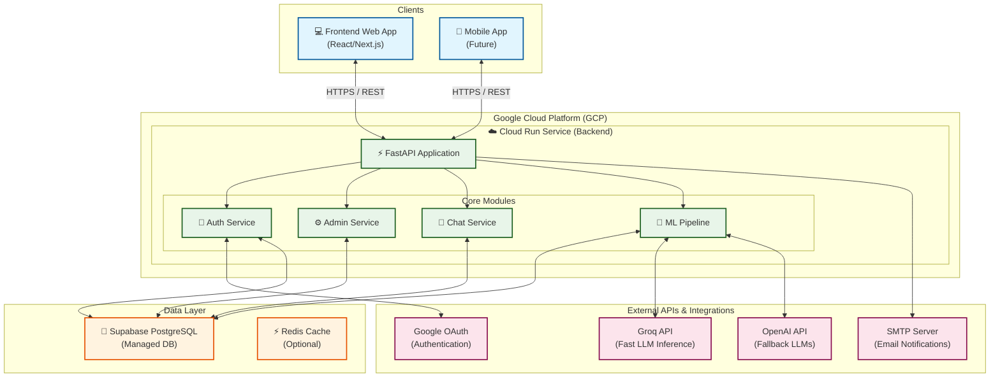

# WellnessWay: Architecture & Production Deployment Guide

This document serves as the single source of truth for the WellnessWay backend architecture, deployment process, and troubleshooting. It is designed to be easily readable by both human developers and LLMs to understand the system context and deployment pipelines.

## 1. High-Level Architecture

The WellnessWay platform uses a modern, containerized backend communicating with a managed database and external AI APIs.



---

## 2. Infrastructure Overview

*   **Backend Hosting**: Google Cloud Run (Serverless, auto-scaling containers).
*   **Database**: Supabase (Hosted PostgreSQL natively supported via SQLAlchemy).
*   **CI/CD Pipeline**: GitHub Actions (`.github/workflows/google-cloud-run.yml`).
*   **Authentication**: Custom JWT (Email/Password) AND Google OAuth.

---

## 3. Custom Domain Guide

When you purchase a brand-new domain (e.g., `wellnessway.com`) and want to deploy the application, here are the step-by-step changes required across the stack:

### A. Google Cloud Run Setup
1. Go to the **Google Cloud Console > Cloud Run**.
2. Click **Manage Custom Domains**.
3. Select your service (`wellness-way-backend`) and map it to your new API subdomain (e.g., `api.wellnessway.com`).
4. GCP will provide `A`, `AAAA`, or `CNAME` records.
5. In your domain registrar (GoDaddy, Namecheap, Route53, etc.), add the DNS records provided by Google. Wait 15-30 minutes for DNS propagation and SSL certificate provisioning.

### B. Google OAuth Console Setup
1. Go to **Google Cloud Console > APIs & Services > Credentials**.
2. Edit your OAuth 2.0 Client ID.
3. Under **Authorized JavaScript origins**, add your frontend URL (e.g., `https://wellnessway.com`).
4. Under **Authorized redirect URIs**, add the frontend redirects and backend Swagger docs (if applicable), e.g., `https://api.wellnessway.com/docs/oauth2-redirect`.

### C. Backend Configuration (GitHub Secrets)
You *must* update the backend to trust the new domain. In your GitHub Repository **Settings > Secrets and Variables > Actions**:

1.  **`CORS_ORIGINS`**: Update to include the new frontend domains.
    *   *Format:* `https://wellnessway.com;https://www.wellnessway.com;http://localhost:3000`
2.  **`TRUSTED_HOSTS`**: Update to include the new backend domain.
    *   *Format:* `api.wellnessway.com;localhost;127.0.0.1;0.0.0.0`
3.  **`APP_BASE_URL`**: Update this if email templates or logic links back to the frontend.
    *   *Format:* `https://wellnessway.com`

---

## 4. Production Deployment Process

Deployments are entirely automated using GitHub Actions.

1.  Make sure your local changes are committed cleanly.
2.  Update environment variables locally via `.env` for testing if necessary.
3.  Execute the standard push to the `dev` or `main` branch.
    ```bash
    git add .
    git commit -m "Your descriptive message"
    git push origin dev
    ```
4.  The action (`google-cloud-run.yml`) triggers automatically.
    *   It checks out the code, logs into Google Cloud, builds the Docker image, pushes it to Google Artifact Registry, and deploys it to Cloud Run.
    *   During deployment, it reads the GitHub Secrets and injects them as `--set-env-vars` onto the container.

---

## 5. Critical Development Lessons & Troubleshooting

If a future update breaks the deployment, check these historical traps first:

### 🚨 1. The GitHub Secrets Formatting Trap (GCloud Parsing Bug)
**The Problem:** The `CORS_ORIGINS` and `TRUSTED_HOSTS` secrets used to be standard JSON arrays (`["https://example.com", "http://localhost:3000"]`). However, when `gcloud run deploy --set-env-vars` runs in CI, the shell expands this string, and GCP interprets the `comma` inside the array as a variable delimiter! This resulted in corrupted variables (e.g., setting `CORS_ORIGINS` to `["https://example.com"`) and Cloud Run crashing on startup.
**The Fix:** 
1. The backend (`config.py`) was reconfigured to type these fields as **raw strings** (`str`) rather than `List[str]` to prevent Pydantic from trying to perform auto-JSON validation explicitly. 
2. The `SecuritySettings.__init__` handles parsing lists out of **semicolon-separated strings** (e.g., `https://example.com;http://localhost:3000`).
**Future Rule:** **Never** place brackets `[]` or commas `,` in `CORS_ORIGINS` or `TRUSTED_HOSTS` GitHub secrets. Use semicolons `;`.

### 🚨 2. The Silent Configuration Crash
**The Problem:** During a refactor from Pydantic v1 to v2, a `@validator` NameError prevented the app from starting. However, on Cloud Run, the container simply timed out after 300 seconds without throwing the stack trace. 
**Why?** The fallback error handler in `config.py` attempted to print the exception to `sys.stderr`, but `sys` had not been imported. The error logger crashed entirely and swallowed the original exception silently.
**The Fix:** Always verify that fundamental imports like `sys`, `os`, and `logging` exist universally if utilizing defensive `except Exception:` blocks, specifically near root configuration initializations.

### 🚨 3. Startup Times and ML Pipeline Drag
**The Problem:** Importing heavy ML libraries (like `torch` and `sentence_transformers`) at the module root-level causes Python cold starts to exceed 30+ seconds. In constrained environments like single-CPU Cloud Run instances, this easily breaches startup health check thresholds, causing rolling deployment failures.
**The Fix:** We confirmed that `app.api.endpoints.diet_plans_ml` correctly utilizes **lazy, inline imports** (e.g. `from app.services.ml_diet_pipeline... import...` enclosed within async path operations). **Maintain this pattern.** Do not lift heavy ML imports to the top of any route or main module!
