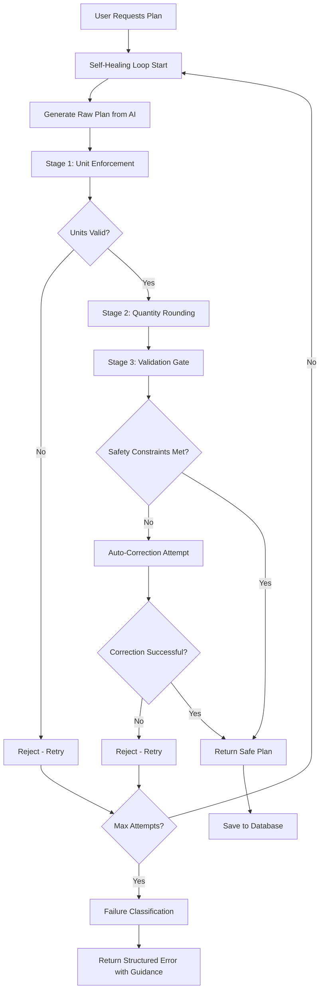

# Complete Safety Pipeline Implementation

## Overview

The WellnessWay Diet Planner now implements a comprehensive safety pipeline that ensures no unsafe diet plans can reach users. The system includes self-healing generation loops, unit enforcement, quantity rounding, validation gates, and failure classification.

## Architecture Components

### 1. Self-Healing Generation Loop
**Location**: `backend/app/services/diet_plan_service.py`

**Key Features**:
- Maximum 10 attempts per plan generation
- Automatic retry on safety violations
- Tracks violation history for failure analysis
- Applies to all generation methods: `generate_weekly_plan()`, `generate_daily_plan()`, `regenerate_day()`, `regenerate_meal()`

**Flow**:
```python
for attempt in range(1, max_attempts + 1):
    try:
        raw_plan = await generate_raw_plan()
        safe_plan = await run_safety_pipeline(raw_plan)
        return save_plan(safe_plan)  # Success!
    except (ContractViolationError, PlanValidationError):
        if attempt == max_attempts:
            return classify_failure_and_provide_guidance()
        continue  # Retry
```

### 2. Unit Enforcement System
**Location**: `backend/app/services/unit_enforcement.py`

**Responsibilities**:
- Enforces canonical units (grams only for solids)
- Bans non-weight units completely (cups, pieces, tbsp, etc.)
- Converts discrete items to standard weights (1 egg = 50g)
- Converts cooked ingredients to raw equivalents
- Rejects plans with unit violations

**Critical Rules**:
- ✅ Allowed: `grams (g)`, `milliliters (ml)` for liquids
- 🚫 Banned: `cup`, `piece`, `large`, `medium`, `tbsp`, `tsp`, etc.
- 🔄 Converted: Discrete items → grams, Cooked → raw

### 3. Quantity Rounding System
**Location**: `backend/app/services/quantity_rounding.py`

**Rounding Rules**:
- **Solid foods**: Round to nearest 5g (practical measuring)
- **Seeds/powders**: Round to nearest 1g (precision needed)
- **Liquids**: Round to nearest 10ml (measuring cup increments)
- **Discrete items**: Whole numbers only (can't have 1.5 eggs)

**Benefits**:
- Human-friendly portions
- Practical kitchen measurements
- Eliminates impossible precision (47.3g → 45g)

### 4. Validation Gate
**Location**: `backend/app/services/plan_validation.py`

**Safety Constraints**:
- Minimum daily calories (prevents starvation)
- Minimum protein requirements (prevents malnutrition)
- Maximum calorie deficit (prevents extreme dieting)

**Auto-Correction**:
- Increases portion sizes of protein-rich foods
- Adds healthy snacks if calories too low
- Maximum 2 correction attempts
- Rejects plans that can't be made safe

### 5. Failure Classification System
**Location**: `backend/app/services/failure_classification.py`

**Failure Categories**:
- **Constraint Conflict**: Protein target too high for calories
- **Unit Resolution Failure**: AI used banned units
- **Diet Restriction Deadlock**: Vegan + allergies + high protein
- **Portion Scaling Failure**: Per-meal protein cap exceeded
- **AI Service Error**: Rate limits, timeouts
- **Validation Timeout**: Failed after 10 attempts

**User Guidance**:
- Identifies specific blocking issues
- Provides actionable suggestions
- Maps to Health Context Document fields

## Complete Safety Pipeline Flow



## API Integration

### Enhanced Error Responses

The API now returns structured error responses with actionable guidance:

```json
{
  "status": "generation_failed",
  "primary_reason": "Combination of diet restrictions makes it impossible to meet nutritional targets",
  "suggested_actions": [
    "Reduce protein target for plant-based diets",
    "Minimize allergy and avoidance lists",
    "Consider less restrictive diet type temporarily"
  ],
  "message": "Unable to generate safe diet plan after multiple attempts"
}
```

### Frontend Integration

The frontend `SafetyViolationScreen.tsx` component handles these structured errors and displays:
- Clear explanation of the issue
- Specific actionable steps
- Retry mechanisms
- Educational content about safety constraints

## Regeneration Methods

### How Regenerate Day Works
1. **Daily Plans**: Regenerates entire plan using main generation method
2. **Weekly Plans**: Regenerates specific day with safety pipeline
3. **Self-Healing**: Uses same retry loop as main generation
4. **Safety Pipeline**: All regenerated content goes through complete pipeline

### How Regenerate Meal Works
1. **Generates**: New daily plan and extracts specific meal
2. **Safety Pipeline**: Runs meal through unit enforcement, rounding, validation
3. **Integration**: Updates existing plan with safe meal
4. **Recalculation**: Updates daily/weekly totals

## Testing and Validation

### Test Coverage
- **Unit Tests**: Each component tested individually
- **Integration Tests**: Complete pipeline tested end-to-end
- **Property-Based Tests**: Safety constraints validated across inputs
- **Runtime Evidence**: Proof of rejected/corrected plans

### Key Test Files
- `backend/test_complete_safety_pipeline.py` - Complete integration test
- `backend/test_runtime_evidence.py` - Runtime proof points
- `backend/test_hard_output_gate.py` - Validation gate tests

## Deployment Considerations

### Performance Impact
- **Retry Loop**: May increase response time for problematic plans
- **Pipeline Stages**: Each stage adds processing overhead
- **Auto-Correction**: Additional computation for plan fixes

### Monitoring
- **Attempt Counts**: Track how many attempts plans require
- **Failure Categories**: Monitor common failure patterns
- **Success Rates**: Measure pipeline effectiveness

### Configuration
- **Max Attempts**: Configurable (default: 10)
- **Safety Constraints**: Per-user from Health Context Document
- **Rounding Rules**: Adjustable by ingredient category

## Security and Safety

### Hard Guarantees
- **No Unsafe Plans**: Impossible for unsafe plans to reach UI
- **Unit Consistency**: All ingredients guaranteed in canonical units
- **Human-Friendly**: All quantities practical for real kitchens
- **Actionable Errors**: Users always get guidance on failures

### Audit Trail
- **Validation Status**: Every plan includes validation metadata
- **Attempt History**: Track how many attempts were needed
- **Pipeline Stages**: Log which stages were applied
- **Failure Analysis**: Detailed classification of any failures

## Future Enhancements

### Potential Improvements
1. **Machine Learning**: Learn from failure patterns to improve success rates
2. **Caching**: Cache successful ingredient combinations
3. **Optimization**: Reduce pipeline overhead for simple plans
4. **Analytics**: Track user success patterns and common issues

### Extensibility
- **New Constraints**: Easy to add additional safety rules
- **Custom Rounding**: Configurable rounding rules per user
- **Enhanced Classification**: More detailed failure analysis
- **Integration Points**: Plugin architecture for additional validation

## Conclusion

The complete safety pipeline ensures that WellnessWay Diet Planner provides safe, practical, and user-friendly diet plans while maintaining high reliability and providing actionable guidance when issues occur. The self-healing approach minimizes user friction while the comprehensive validation ensures safety is never compromised.