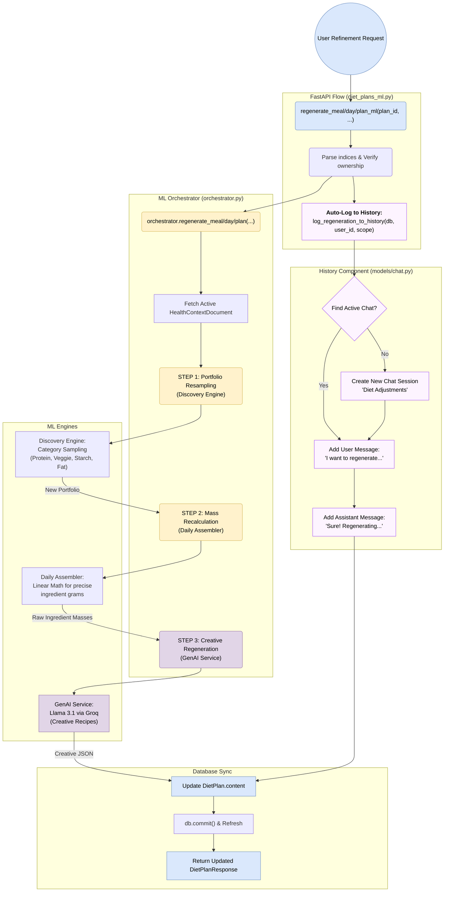

# Detailed Flow Diagram: AI Refinement & History Logging

This diagram illustrates the end-to-end flow of a diet plan refinement request, highlighting how the system orchestrates the ML pipeline and automatically persists the interaction in the **Conversation History**.

## Flow Highlights

### 1. Automatic "Shadow" Logging
Unlike standard generation, **Refinement** requests (regenerating a meal or day) trigger an automatic background logging task. The system looks for the user's most recent active chat session. If found, it appends the intent and the bot's acknowledgment; otherwise, it silently creates a new "Diet Adjustments" thread.

### 2. State-Aware ML Pipeline
The `ML Orchestrator` remains the single source of truth for diet logic. When a regeneration is triggered:
- **Scope Isolation**: Only the targeted meal or day is recalculated, preserving the rest of the plan.
- **Dynamic Resampling**: The Discovery Engine provides fresh ingredient candidates while maintaining the user's macronutrient constraints and recently updated preferences (like `cuisine`).

### 3. Contextual Retrieval (Architecture Ready)
While the current implementation focus is on **logging**, the architecture is now "plumbed" to allow the `GenAI Service` to query the `Messages Table` before generation. This will enable future features where the AI can say: *"Since you didn't like the salmon yesterday, I've replaced it with grilled cod."*
